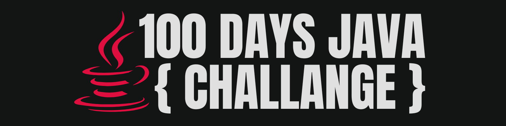

# 🚀 100 Days of Java Challenge

<div align="center">  </div>

This repository was created to document and organize my progress in the 100 Days of Java Challenge, which started on September 8, 2024. The goal is to advance in learning the Java language, covering fundamentals, intermediate concepts, and more advanced topics throughout the journey.

```Start: 08/09/2024 | Estimated End: 17/12/2024 ```

## 📌 Topics Covered

<details> <summary>Days 01 to 10</summary>

###### Day 01

- Initial planning and development environment setup.

###### Day 02

###### Day 03

###### Day 04

###### Day 05

###### Day 06

###### Day 07

###### Day 08

###### Day 09

###### Day 10

###### 🏆 Summary of Days 01 to 10:

</details> <details> <summary>Days 11 to 20</summary>

###### Day 11

###### Day 12

###### Day 13

###### Day 14

###### Day 15

###### Day 16

###### Day 17

###### Day 18

###### Day 19

###### Day 20

🏆 Summary of Days 11 to 20:

</details> <details> <summary>Days 21 to 30</summary>

###### Day 21

###### Day 22

###### Day 23

###### Day 24

###### Day 25

###### Day 26

###### Day 27

###### Day 28

###### Day 29

###### Day 30

🏆 Summary of Days 21 to 30:

</details> <details> <summary>Days 31 to 40</summary>

###### Day 31

###### Day 32

###### Day 33

###### Day 34

###### Day 35

###### Day 36

###### Day 37

###### Day 38

###### Day 39

###### Day 40

🏆 Summary of Days 31 to 40:

</details> <details> <summary>Days 41 to 50</summary>

###### Day 41

###### Day 42

###### Day 43

###### Day 44

###### Day 45

###### Day 46

###### Day 47

###### Day 48

###### Day 49

###### Day 50

🏆 Summary of Days 41 to 50:

</details> <details> <summary>Days 51 to 60</summary>

###### Day 51

###### Day 52

###### Day 53

###### Day 54

###### Day 55

###### Day 56

###### Day 57

###### Day 58

###### Day 59

###### Day 60

🏆 Summary of Days 51 to 60:

</details> <details> <summary>Days 61 to 70</summary>

###### Day 61

###### Day 62

###### Day 63

###### Day 64

###### Day 65

###### Day 66

###### Day 67

###### Day 68

###### Day 69

###### Day 70

🏆 Summary of Days 61 to 70:

</details> <details> <summary>Days 71 to 80</summary>

###### Day 71

###### Day 72

###### Day 73

###### Day 74

###### Day 75

###### Day 76

###### Day 77

###### Day 78

###### Day 79

###### Day 80

🏆 Summary of Days 71 to 80:

</details> <details> <summary>Days 81 to 90</summary>

###### Day 81

###### Day 82

###### Day 83

###### Day 84

###### Day 85

###### Day 86

###### Day 87

###### Day 88

###### Day 89

###### Day 90

🏆 Summary of Days 81 to 90:

</details> <details> <summary>Days 91 to 100</summary>

###### Day 91

###### Day 92

###### Day 93

###### Day 94

###### Day 95

###### Day 96

###### Day 97

###### Day 98

###### Day 99

###### Day 100

🏆 Summary of Days 91 to 100:

</details>

## 🛠️ **Tools Used**

- [GitHub](https://github.com) - For version control.
- [Obsidian](https://obsidian.md) - For notes and organization.
- [VS Code](https://code.visualstudio.com) - Lightweight and extensible editor.
- [IntelliJ IDEA](https://www.jetbrains.com/idea) - Main IDE for development.
- [Eclipse](https://www.eclipse.org) - Additional IDE for comparison.
- [NetBeans](https://netbeans.apache.org) - Additional IDE for comparison.

## 🌟 **Recommended Resources**

- [🏆 100DaysOfCode](https://www.100daysofcode.com/) - The Official Website for the Challenge.
- [📘 100 Days of Code - Java Learning Platform](https://www.100daysofcode.io/learn/java) - Comprehensive guide for the challenge.
- [📖 "Java: The Complete Reference" by Herbert Schildt](https://www.amazon.com.br/Java-Complete-Reference-Herbert-Schildt/dp/0071808558) - An extensive book on Java.
- [📚 Oracle Java Documentation](https://docs.oracle.com/javase/) - Official Oracle documentation for Java.
- [🌐 Dev.java](https://dev.java/) - Comprehensive resources and tools for Java developers.

## 📁 **Repositories and Projects**

- [🚀 DevDojo - Java Marathon](https://github.com/devdojobr/maratona-java-virado-no-jiraya) - Reference repository for the course.

## 🎥 **Videos**

- [🇧🇷 Playlist: Java Marathon Challenge (Português)](https://youtube.com/playlist?list=PL62G310vn6nFIsOCC0H-C2infYgwm8SWW&si=C1ei7pVWop8QKejc) - Videos for course follow-up.
- [🇬🇧 Playlist: Java Marathon Challenge (English)](https://youtube.com/playlist?list=PL0Un1HNdB4jGKw5szJrQETqJTlZKyKReu&si=gOmY81l5ih6VROo8) - Videos for course follow-up.

## 🎯 **Goals**

This repository reflects my commitment and progress in the 100 Days of Java Challenge. Throughout the days, I aimed to consolidate my knowledge and expand my skills in Java. Although I already had a foundation in Java from my university studies, this challenge provided me with an opportunity to deepen and update my understanding of both fundamental and advanced topics.
